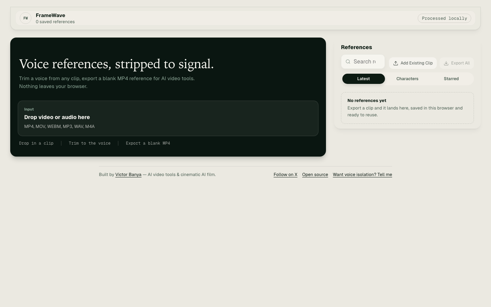

# FrameWave



FrameWave turns any video or audio clip into a blank voice reference video: the original audio with a black video track, ready to hand to AI video tools that accept video references but not audio files.

Use it live at [victor-in-focus.github.io/framewave](https://victor-in-focus.github.io/framewave/). Built by [VictorInFocus](https://x.com/VictorInFocus) for AI video creators who need video references when their tools will not accept plain audio.

Everything runs in your browser. Source files are processed locally with FFmpeg compiled to WebAssembly and saved references live in your browser's local library (IndexedDB). Nothing is uploaded anywhere.

## Run Locally

```bash
npm install
npm run dev
```

Open the local URL printed by Vite. No backend, no other services.

## How It Works

- The React frontend handles upload, the trim timeline, naming, batching, and the local library.
- FFmpeg.wasm (single-threaded build, bundled at build time) trims the selected audio range and muxes it with a generated 1280x720 black video track into an MP4.
- Batch export processes each clip in the browser and packages the results as a ZIP.
- The library stores clips, tags, favorites, and thumbnails in IndexedDB; "Export All" downloads the whole library as a ZIP.

## Development

```bash
npm test        # vitest suite
npm run build   # typecheck + production build
```

## Deploy

The app is a static site. Any static host works; Cloudflare Pages settings:

- Build command: `npm run build`
- Output directory: `dist`

Optional analytics: the app fires three anonymous funnel events
(`source_loaded`, `clip_exported`, `batch_exported`) through
[src/lib/analytics.ts](src/lib/analytics.ts) if a Plausible-compatible
script is present on the page. Without one, nothing is tracked.

## License

MIT - see [LICENSE](LICENSE).

## Privacy

Videos and audio never leave your machine. There is no server, no accounts, and no tracking of your media.
